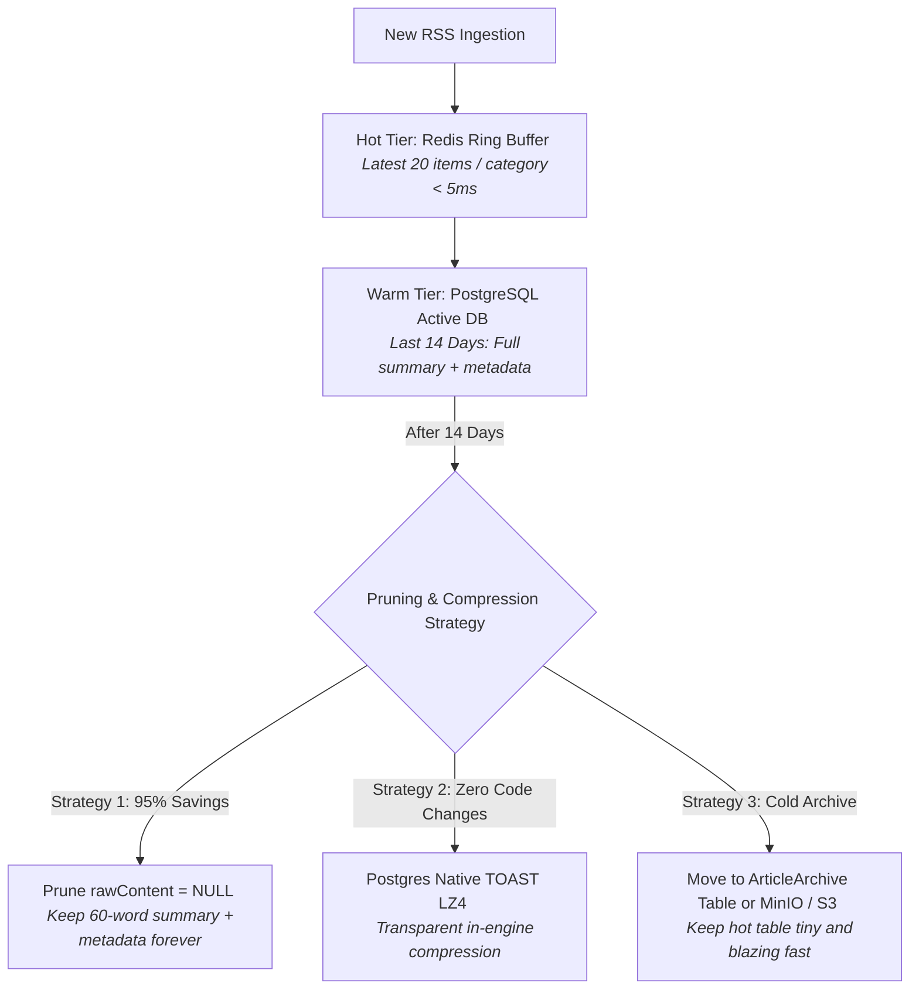

# 🧠 NewsFlow Backend Knowledge Base: High-Efficiency Text Compression & Cold Article Storage

## 📌 1. The Problem: Old News Articles & Database Memory Bloat

As NewsFlow ingests RSS feeds continuously (50–100 articles every 5 minutes across 30+ feeds), the database accumulates tens of thousands of articles per month.

### Anatomy of an Article Row in PostgreSQL:
```
┌─────────────────────────────────────────────────────────────────────────────┐
│ 1. Metadata: ID, Hash, Title, Category, URL, ImageUrl (~400 bytes)   [  2%] │
│ 2. 60-Word Inshorts Summary: summary (~350 bytes)                   [  2%] │
│ 3. Full Scraped Web Content: rawContent (15,000 - 45,000 bytes)      [ 96%] │
└─────────────────────────────────────────────────────────────────────────────┘
```

> **Key Insight**: Over **95% of database storage bloat** is caused by `rawContent` (the full scraped HTML/text).
> In a news app:
> - Users **only read the 60-word summary and the headline**.
> - Nobody reads the full `rawContent` of an article that is 14 or 30 days old.
> - Holding uncompressed full text for 100,000 old articles wastes **3 to 5 GB of RAM and disk space** on indexes and table pages that are never queried!

---

## 🐳 2. Is There a Docker Image That Compresses Text?

### The Short Answer:
Unlike image processing (where a specialized image proxy container like `imgproxy` is needed to handle complex image decoders), **text compression does NOT require an external microservice container**, because:
1. **PostgreSQL already has built-in compression (TOAST LZ4/pglz)**.
2. **Node.js has native zlib/Brotli/zstd compression** built directly into the runtime.

However, if you want a **specialized Docker container optimized for massive text compression**, the industry standard solutions are:

### Recommended Docker Images for High-Compression Text & Analytics:

| Docker Image | Type | Compression Efficiency | Best Use Case |
| :--- | :--- | :---: | :--- |
| **`timescale/timescaledb:latest-pg16`** | PostgreSQL + Columnar Compression Extension | **85% – 90%** | **Drop-in replacement for Postgres**. Compresses historical article chunks automatically using Zstandard (zstd) while remaining standard PostgreSQL. |
| **`clickhouse/clickhouse-server:latest`** | Columnar Analytical Database | **90% – 95%** | Industry champion for text logs and archived content. Compresses 100 GB of text down to ~8 GB. |
| **`minio/minio:latest`** | Self-Hosted S3 Object Storage | **85% – 92%** (with Gzip/Zstd) | Offload cold articles older than 30 days as compressed `.json.zst` files, freeing 100% of database memory. |

---

## 🛠️ 3. Four Actionable Strategies to Reduce Memory for Old Articles



---

### Strategy 1: The "Raw Content Pruning" Strategy ⭐ (RECOMMENDED — 95% Space Savings)
Since users only read the **60-word summary** and the headline, the heavy `rawContent` (15–40 KB per article) is completely useless once an article is older than 7 or 14 days.

#### Implementation: Automated Daily Maintenance Cron
Add a lightweight maintenance cron in `backend/src/workers/ingestWorker.ts` or database scheduler:
```typescript
// Run daily at midnight: Clear rawContent for articles older than 14 days
export async function pruneOldArticleBodies() {
  const result = await prisma.$executeRawUnsafe(`
    UPDATE "Article"
    SET "rawContent" = NULL
    WHERE "publishedAt" < NOW() - INTERVAL '14 days'
      AND "rawContent" IS NOT NULL;
  `);
  console.log(`🧹 [Pruning Worker] Cleared rawContent for old articles to reclaim memory.`);
}
```

#### Why this is the best approach:
- **Instant 90–95% memory drop**: 100,000 articles drop from **4.5 GB down to ~350 MB**!
- **Zero broken features**: Search, headlines, 60-word summaries, category filters, and bookmarks continue to work 100% normally.
- **Zero extra Docker containers needed**.

---

### Strategy 2: PostgreSQL Native TOAST LZ4 Compression (Zero Code Changes)
PostgreSQL stores fields exceeding 2 KB in a **TOAST table** (The Oversized-Attribute Storage Technique). By default, older Postgres instances use `pglz`, but PostgreSQL 14+ supports **LZ4**, which is **4x faster and significantly more compressed**.

#### How to Enable LZ4 on PostgreSQL:
Run this once on your database:
```sql
ALTER TABLE "Article" ALTER COLUMN "rawContent" SET COMPRESSION lz4;
ALTER TABLE "Article" ALTER COLUMN "summary" SET COMPRESSION lz4;
```
When articles are written, PostgreSQL transparently compresses the text with LZ4 without any application code changes.

---

### Strategy 3: In-Row Binary Brotli/ZSTD Compression (For Long-Term Storage)
If you must keep the full raw article text forever, compress the text using Node.js native `zlib` (Brotli) before storing it in a binary (`Bytes` / `bytea`) column:

```typescript
import zlib from 'zlib';

// Compress before saving (15 KB -> 1.8 KB)
const compressedBuffer = zlib.brotliCompressSync(Buffer.from(rawContent, 'utf-8'));

// Decompress only if a user specifically requests the full raw article
const decompressedText = zlib.brotliDecompressSync(compressedBuffer).toString('utf-8');
```
- **Compression Ratio**: ~88% reduction.
- A 25 KB article text compresses to **~2.8 KB**.

---

### Strategy 4: Tiered Cold Archiving (Hot Table ➔ Archive Table / S3)
Move articles older than 30 days out of the primary `Article` table into an `ArticleArchive` table (or S3/MinIO as compressed `.json.gz` files):
1. Keeps the primary `Article` table small (e.g. only holding the last 30 days).
2. All PostgreSQL indexes (B-Tree indexes on `publishedAt`, `category`, `hash`) remain tiny and stay entirely in PostgreSQL's high-speed RAM buffer cache (`shared_buffers`).
3. Memory consumption never grows beyond a fixed, predictable ceiling.

---

## 📊 Summary Comparison: Which Approach Should You Choose?

| Strategy | Storage Reduction | Implementation Effort | Extra Docker Service? | Recommendation |
| :--- | :---: | :---: | :---: | :--- |
| **1. Prune `rawContent` after 14 days** | **~95%** | **5 minutes (1 cron query)** | ❌ None | **⭐⭐⭐⭐⭐ BEST CHOICE**: Instant massive memory savings, zero complexity. |
| **2. Postgres TOAST LZ4** | **~60%** | **1 SQL statement** | ❌ None | **⭐⭐⭐⭐ Recommended**: Automatic transparent compression. |
| **3. Node Brotli Binary Column** | **~85%** | Medium (Schema change) | ❌ None | Good if you must retain full text forever. |
| **4. ClickHouse / TimescaleDB Docker** | **~92%** | High (New database container) | ✅ Yes | Recommended only at scale of 10M+ articles. |
